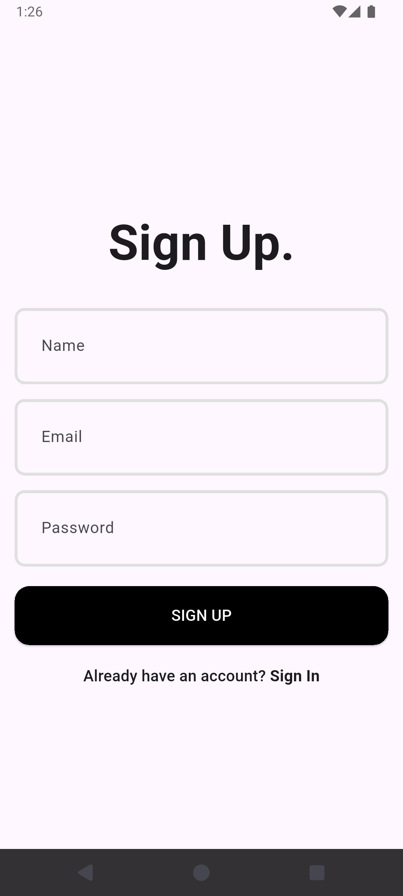
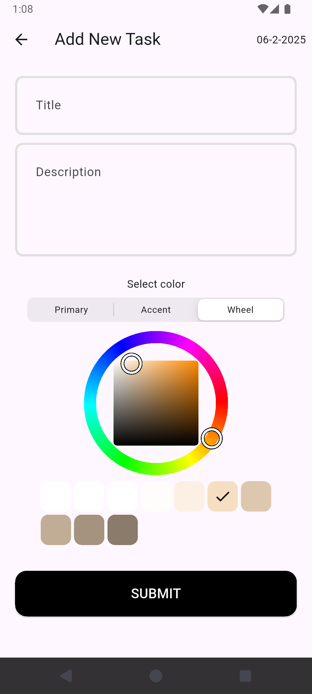

# Task Manager App 📱

A powerful Flutter task management application with offline-first architecture, featuring seamless synchronization with a FastAPI backend and robust local data persistence.

## 📱 Screenshots

<div align="center">
  
  
  
  
  
  
</div>

## 🌟 Features

### Core Functionality

- ✅ **Task Management**: Create, view, and delete tasks with rich details
- 🎨 **Custom Color Coding**: Assign hex colors to categorize tasks
- 📅 **Due Date Management**: Set and track task deadlines
- 🔐 **User Authentication**: Secure signup and login system
- 📱 **Cross-Platform**: Native iOS and Android support

### Advanced Features

- 🌐 **Offline-First Architecture**: Full functionality without internet connection
- 🔄 **Automatic Sync**: Seamlessly synchronize data when network is available
- 💾 **Local Database**: SQLite database for persistent offline storage
- 🔌 **Network Detection**: Intelligent connectivity monitoring
- 🎯 **State Management**: Robust state management using Cubit pattern

## 🏗️ Architecture

### Project Structure

```
lib/
├── core/
│   ├── constants/        # App constants and configuration
│   ├── services/         # Core services (API, Database, Auth)
│   └── utils.dart        # Utility functions and helpers
├── features/
│   ├── auth/
│   │   ├── cubit/        # Authentication state management
│   │   ├── pages/        # Login and signup screens
│   │   └── repository/   # Auth data layer
│   └── home/
│       ├── cubit/        # Task management state
│       ├── pages/        # Task screens
│       ├── repository/   # Task data layer
│       └── widgets/      # Reusable task widgets
├── models/               # Data models and entities
├── main.dart             # App entry point
└── my_app.dart           # App configuration
```

### Key Technologies

- **Frontend**: Flutter with BLoC pattern
- **Backend**: FastAPI with Prisma ORM
- **Database**:
  - Local: SQLite (sqflite)
  - Remote: NeonDB (PostgreSQL)
- **State Management**: flutter_bloc
- **Network**: HTTP client with connectivity monitoring

## 🔧 Technical Implementation

### Offline-First Strategy

The app implements a comprehensive offline-first approach:

1. **Local Database Schema**:

   ```sql
   CREATE TABLE tasks (
     id TEXT PRIMARY KEY,
     title TEXT NOT NULL,
     description TEXT NOT NULL,
     hexColor TEXT NOT NULL,
     dueAt TEXT,
     createdAt TEXT NOT NULL,
     updatedAt TEXT NOT NULL,
     isSynced INTEGER DEFAULT 0
   );

   CREATE TABLE users (
     id TEXT PRIMARY KEY,
     name TEXT NOT NULL,
     email TEXT UNIQUE NOT NULL,
     token TEXT
   );
   ```

2. **Sync Strategy**:

   - **Create**: Store locally → Sync when online
   - **Read**: Always from local database
   - **Update**: Update locally → Mark for sync
   - **Delete**: Soft delete locally → Sync deletion

3. **Conflict Resolution**:
   - Server timestamp takes precedence
   - Local changes preserved during offline periods
   - Merge conflicts resolved automatically

### API Integration

The app integrates with the following REST endpoints:

#### Authentication

- `POST /auth/signup` - User registration
- `POST /auth/login` - User authentication
- `GET /auth/token/verify` - Token validation
- `GET /auth/user` - Get user profile

#### Task Management

- `POST /task/add` - Create new task
- `GET /task/list` - Retrieve all tasks
- `DELETE /task/{task_id}` - Delete specific task
- `POST /task/sync` - Bulk synchronization

## 🚀 Getting Started

### Prerequisites

- Flutter SDK (3.0+)
- Dart SDK (3.0+)
- Android Studio / Xcode
- FastAPI backend server

### Installation

1. **Clone the repository**:

   ```bash
   git clone <repository-url>
   cd task-manager-app
   ```

2. **Install dependencies**:

   ```bash
   flutter pub get
   ```

3. **Configure API endpoint**:

   ```dart
   // lib/core/constants/api_constants.dart
   class ApiConstants {
     static const String baseUrl = 'https://your-api-domain.com';
     static const String authEndpoint = '/auth';
     static const String taskEndpoint = '/task';
   }
   ```

4. **Run the app**:
   ```bash
   flutter run
   ```

### Backend Setup

Ensure your FastAPI backend is running with the provided OpenAPI schema. The backend should support:

- CORS for mobile requests
- JWT authentication
- PostgreSQL/NeonDB connection
- All endpoints as defined in the API schema

## 📦 Dependencies

### Core Dependencies

```yaml
dependencies:
  flutter:
    sdk: flutter
  cupertino_icons: ^1.0.8
  shared_preferences: ^2.5.3 # Local key-value storage
  http: ^1.4.0 # HTTP client
  flutter_bloc: ^9.1.1 # State management
  intl: ^0.20.2 # Internationalization
  flex_color_picker: ^3.7.1 # Color selection UI
  connectivity_plus: ^6.1.4 # Network connectivity
  path: ^1.9.1 # File path utilities
  sqflite: ^2.4.2 # SQLite database
  uuid: ^4.5.1 # UUID generation
```

### Development Dependencies

```yaml
dev_dependencies:
  flutter_test:
    sdk: flutter
  flutter_lints: ^5.0.0 # Code quality linting
```

## 🤝 Contributing

1. Fork the repository
2. Create a feature branch (`git checkout -b feature/amazing-feature`)
3. Commit your changes (`git commit -m 'Add amazing feature'`)
4. Push to the branch (`git push origin feature/amazing-feature`)
5. Open a Pull Request

## 📄 License

This project is licensed under the MIT License - see the [LICENSE](LICENSE) file for details.

## 📞 Support

For support, email support@taskmanager.com or join our [Discord community](https://discord.gg/taskmanager).

## 🙏 Acknowledgments

- Flutter team for the amazing framework
- FastAPI community for the robust backend solution
- Contributors and beta testers

---

**Built with ❤️ using Flutter & FastAPI**
